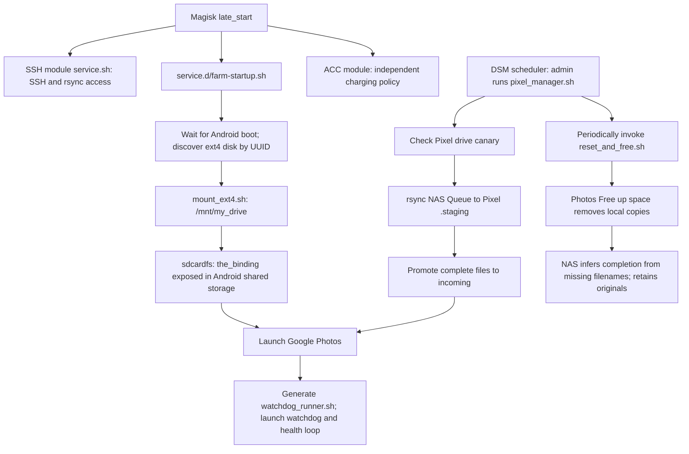

# Synology → Pixel photo backup

Normal runs now **manage the declared source files**. Matching files and
metadata cause no writes; changed or missing sources are installed. A complete
plan for the selected hosts runs before deployment. Production's current files,
ownership and permissions are preserved, including the legacy permission modes.

Storage/runtime activation is a separate explicit play. Normal management does
not mount storage, restart workers, send UI taps, run transfers or upgrade
anything. Installing the Magisk hook enables it for the next boot. Installing a
NAS manager makes it available to the manually configured DSM task.

## Responsibilities

| Layer | Owner | What it supplies |
| --- | --- | --- |
| Prepared phone | Operator | Android 10, Magisk, SSH module, root SSH authorization, ext4 drive, Android/Photos setup |
| External storage | `pixel_backup_gang` | Captured helpers that expose an ext4 subtree through Android's shared storage |
| Upload runtime | `pixel_google_photos_runtime` | Magisk boot hook, drive selection, Photos launch, watchdog, health reporting, UI cleanup |
| NAS ingestion | `photo_ingest_controller` + manual DSM setup | Queue/staging protocol, transfer state, periodic cleanup requests |

Inventory's `photo_pipelines` connects a controller to a receiver. Role inputs
describe each implementation; the pipeline passes the receiver's address,
storage path and cleanup command to the NAS controller. NAS login comes from
Vault. Health URLs also come from Vault. No keys or Google credentials belong
in plaintext inventory or source templates.

## What runs, and why



`pixel-backup-gang` has no persistent daemon or mandatory Termux service. Its
upstream installation copies executable helpers; using them requires root and
the global mount namespace. This installation supplies its own boot automation.
See [upstream external-drive setup](https://github.com/master-hax/pixel-backup-gang/blob/master/docs/EXTERNAL_DRIVES.md).

Magisk runs executable files in `/data/adb/service.d` during its nonblocking
late-start stage. Its scripts use BusyBox ash with standalone command lookup.
Our hook waits for `sys.boot_completed` itself. An SSH shell can have a different
PATH: here `/sbin/magisk` exists although `magisk` is not found by name.
See [Magisk boot scripts and BusyBox](https://topjohnwu.github.io/Magisk/guides.html#boot-scripts).

## Commands and execution boundaries

From the repository root, with the existing Vault password and SSH setup:

```sh
# Prepared phone: no installed farm sources or mounted drive required.
ansible-playbook playbooks/photo-backup-prerequisites.yml --check

# Preview desired-state changes on both hosts. No remote writes in check mode.
ansible-playbook playbooks/photo-backup.yml --check

# Manage both installations. Also imported by site.yml --limit photo_backup.
ansible-playbook playbooks/photo-backup.yml

# Inspect the installed runtime and manual DSM setup; always read-only.
ansible-playbook playbooks/photo-backup-status.yml --check

# Separate, explicit operation: preview, then start a completely stopped farm.
ansible-playbook playbooks/photo-backup-activate.yml --check
ansible-playbook playbooks/photo-backup-activate.yml
```

The `host_vars/*/files.yml` definitions declare templates, destinations and
permissions. Role inputs supply script parameters; Vault supplies secrets.
Management renders those inputs and compares the desired bytes and metadata
to the host. Ordinary variable edits therefore produce a visible change.
Use management with `--check` to inspect file drift, and the status play to
inspect platform prerequisites, mounts, workers and manual DSM setup.

### Changes require an idle controller

Check mode reports changes without requiring a maintenance window. Before a
real source change or cold activation, disable **Pixel Upload** in DSM's Task
Scheduler and let any current run finish. The play inspects the declared NAS
peer even under `--limit pixel1`, checks the disabled task, the manager process,
and its existing singleton lock. It does not disable or reenable the schedule.
An unchanged management run bypasses this maintenance requirement entirely.

Each role's `main` entrypoint performs `plan` then `apply` when used by itself.
The pipeline runs all plans first and then calls `apply`, avoiding a second full
platform preflight. Applying still compares each destination immediately before
writes. The Android action's `allow_changes` gate blocks a newly drifted file
when an earlier no-change plan did not establish a maintenance window. Source
rendering is validated locally before connecting to either host.

Activation similarly reuses the source plan, then rechecks mount/worker state
after controller inspection. That last state check protects against concurrent
startup and remains separate from the earlier classification.

The no-op path reads over SSH, with no remote module staging. The Pixel uses
[`android_file`](../action_plugins/android_file.py), a narrow controller action
because Magisk SSH supplies no Python. It implements directory/file desired
state, rejects symlinks, predicts changes in check mode, rechecks before writing,
and sends file content over SSH stdin into a private same-filesystem staging
directory before atomic rename. It returns no file diff. It manages source paths
only, never external photo directories. See Ansible's guidance on
[Python-free targets](https://docs.ansible.com/ansible/latest/collections/ansible/builtin/raw_module.html).

On NAS, changed files use the standard `ansible.builtin.template` module with
`become_user: root`, owner `admin`, group `users`, and the captured mode. Before
that write, an `id -u` task must prove root access. Matching files need no sudo.
For changes, add **`ansible_become_password` inside the encrypted**
`group_vars/photo_controllers/vault.yml` using `ansible-vault edit`; never store
it in plaintext variables or pass it on the command line. Authenticated NAS
sudo has not yet been exercised. A denied escalation stops deployment.

Templates containing health URLs use Vault inputs, `no_log: true`, and
`diff: false`. There are no automatic backups containing plaintext secrets.
Atomic replacement protects each file; installation across multiple files or
hosts is not a transaction. On failure inspect the reported state and rerun;
there is no automatic rollback, deletion, service restart or package upgrade.
The runtime boot hook is published after its dependent sources.

### What machine inspection establishes

| Check | Reason | Defined in |
| --- | --- | --- |
| Android 10, ext4, sdcardfs, root/global namespace | Mounts must use the supported kernel storage model and be visible outside SSH | [storage prerequisites](../roles/pixel_backup_gang/tasks/prerequisites.yml) |
| Magisk/BusyBox, enabled SSH module, persistent authorization | A current SSH connection must not mask missing boot integration | [storage prerequisites](../roles/pixel_backup_gang/tasks/prerequisites.yml) |
| Unique ext4 UUID, Photos permissions, display/input profile | Drive selection and captured UI automation require these inputs | [runtime prerequisites](../roles/pixel_google_photos_runtime/tasks/prerequisites.yml) |
| ext4 → sdcardfs → Photos process mount | A directory or canary alone could refer to internal flash | [installed runtime](../roles/pixel_google_photos_runtime/tasks/observe.yml) |
| Matching canary inode; staging/incoming on the same filesystem | Guard against missing drive and support atomic promotion | [installed runtime](../roles/pixel_google_photos_runtime/tasks/observe.yml) |
| One watchdog and health process | Detect incomplete or duplicated startup | [installed runtime](../roles/pixel_google_photos_runtime/tasks/observe.yml) |

A successful source plan says whether Ansible would change managed files.
It does not establish cloud upload, UI correctness or delivered health pings.
Process existence is a snapshot, not a liveness test. Photos account, Original
quality entitlement, folder backup, staging exclusion and cleanup safety still
require manual inspection.

## Recovery after a phone reset

The phone platform, Google account, NAS accounts/volumes and DSM task remain
manual prerequisites. Ansible installs the captured farm and can explicitly
start it once these requirements hold.

1. **Prepare Android/Magisk manually.** Use the supported Android 10 original
   Pixel platform. Enable the intended Magisk SSH module and its boot service.
   Restore root authorization for both the operator and NAS admin. Magisk SSH
   stores authorization in `/data/ssh/root/.ssh/authorized_keys` (root:root,
   mode 600); `/data/ssh/no-autostart` disables automatic startup.
   See [Magisk SSH configuration](https://github.com/Magisk-Modules-Repo/ssh#configuration).
   The NAS key stays on NAS; a fresh phone also requires reviewed host-key trust
   on the operator and NAS. Operator SSH alone does not prove NAS authorization.
2. **Prepare Photos manually.** Complete primary-user setup, sign into the intended
   Google account, grant storage access, and inspect the backup/quality settings.
   The captured scripts support a noncredential lock screen. Match the display
   and input profile in `host_vars/pixel1/vars.yml`. ACC charging configuration
   is independent of photo transfer and is not currently managed here.
3. **Connect the existing ext4 drive and run the prerequisite play.** It checks
   the configured filesystem UUID without formatting or mounting. A phone reset
   does not require formatting the external drive. A replacement disk needs a
   separately reviewed preparation procedure compatible with this old kernel;
   copying an UUID into inventory does not prepare a disk.
4. **Install the desired sources.** Disable the NAS task and let its current run
   finish. Run the management play with `--check`, review the proposed changes,
   then run it normally. It creates the missing Android helper directory, copies
   the captured helper/runtime sources, and publishes the Magisk hook last.
   It never fetches upstream or installs modules/APKs. The NAS role assumes its
   share, state directories, admin account and task already exist. A missing or
   changed NAS script requires authenticated sudo as described above.
5. **Activate explicitly.** Run the activation play. An already healthy running
   farm is inspected without changes. A completely stopped/unmounted farm may
   start only while the controller is disabled and idle. Partial mounts, existing
   workers, a startup in progress, or nonempty unmounted target directories cause
   failure. The guarded activation invokes the captured boot hook with Magisk's
   BusyBox environment, verifies the actual ext4/sdcardfs chain, then creates
   **only missing** `.staging`, `incoming`, and `.mount_check` on that verified
   external filesystem. Existing drive state is retained. It never formats or
   repairs a disk, kills workers, unmounts storage, runs Free up space, or reboots.
   A failed activation leaves observed state for diagnosis; it does not blindly
   retry startup. The temporary `.ansible-activation` directory is a singleton
   lock; after an interrupted process, confirm it is dead before removing a
   stranded lock manually.
6. **Complete app setup with the mount present.** Enable backup for `incoming`
   in Photos. Establish that `.staging` is excluded from scanning while transfers
   are partial. Inspect the current Photos menus against the cleanup coordinates.
   A controlled disposable-media exercise is needed before enabling unattended
   cleanup; a shell exit code cannot verify that the correct button was tapped.
7. **Inspect the installed farm and NAS access.** Run the status play and
   management with `--check`. Verify the NAS admin's own SSH key and reviewed host key.
   Check received health reports and dashboard grace periods. Restore scheduled
   transfers only after these conditions and the manual checks hold.

## Remaining limits and follow-ups

- **Partial uploads:** staging is hidden and promotion follows successful rsync,
  but Photos' exclusion behavior is still unverified. The live `.staging` had
  no `.nomedia` marker during this inspection. Its absence is reported, not
  silently repaired. NAS's four-minute mtime rule also does not prove a phone
  has finished writing to the NAS Inbox.
- **Mount failures:** startup invokes `sh ./mount_ext4.sh`, bypassing the
  helper's `-e` shebang. Its final success message can mask intermediate errors.
  The captured helper recursively changes drive permissions and sets SELinux
  permissive. Current upstream uses a different labeling approach; these are
  deliberate follow-up changes, not an automatic upgrade.
- **Boot failure:** a missing drive causes startup to exit before either worker
  starts. Reconnecting a disk afterward does not rerun startup. The explicit
  activation play handles only a fully stopped farm. Partial recovery still
  needs diagnosis; it deliberately refuses to unmount or kill workers.
- **Cloud completion:** NAS treats local disappearance as completion. Manual
  deletion or incorrect UI cleanup can produce false completion. No Google API
  receipt or end-to-end content verification is implemented.
- **Reproducibility:** captured helper bytes are versioned in this repository;
  the upstream revision is unknown. The inspected platform was Magisk `30.7`,
  SSH module `v0.27`,
  ACC `v2025.5.18-dev`, and Photos `7.57.0.843750501`. These are observations,
  not upgrade targets. Module/APK recovery artifacts, Google setup, ACC policy,
  and Healthchecks dashboard configuration remain outside automation.

## Verification scope

Before this cleanup, check mode and a normal management run reported
`changed=0`, `unreachable=0`, `failed=0` on both live hosts. The normal run
traversed the actual file-management path.

For this cleanup, all 14 rendered files matched their previous hashes and
retained their deployment settings. Management, read-only status and activation
check mode passed on both live hosts with zero changes. Activation recognized
the running farm and proposed no startup. The 31 local tests passed; writer
logic and deployed source templates were unchanged.

Python/YAML parsing and rendered activation-shell syntax were checked locally.
Fresh installation, authenticated
NAS sudo and cold activation have not been exercised on disposable hardware.
The photo backup test suite covers local validation, read-only status boundaries
and the actual Android writer against disposable files. Writer cases include unchanged
files, check mode, writes blocked outside maintenance, atomic install/update,
empty files, symlinks and a concurrent edit between inspection and publication.
Configuration tests use the local validation entrypoint; they never use live SSH.
