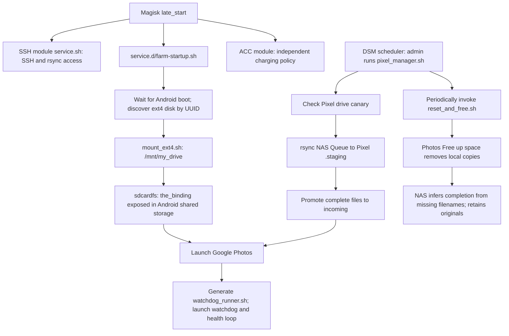

# Synology → Pixel photo backup

**This repository currently audits the installation; it does not rebuild it.**
The default site never installs scripts, creates drive markers, mounts storage,
starts workers, changes Android settings, or upgrades packages. A successful
audit means the checked requirements hold, not that Google has backed up a photo.

## Responsibilities

| Layer | Owner | What it supplies |
| --- | --- | --- |
| Prepared phone | Operator | Android 10, Magisk, SSH module, root SSH authorization, ext4 drive, Android/Photos setup |
| External storage | `pixel_backup_gang` | Captured helpers that expose an ext4 subtree through Android's shared storage |
| Upload runtime | `pixel_google_photos_runtime` | Magisk boot hook, drive selection, Photos launch, watchdog, health reporting, UI cleanup |
| NAS ingestion | `photo_ingest_controller` + manual DSM setup | Queue/staging protocol, transfer state, periodic cleanup requests |

Inventory's `photo_pipelines` connects a controller to a receiver. Role inputs
describe each implementation; the pipeline passes the receiver's address,
storage path and cleanup command to the NAS controller. NAS login comes from
Vault. Health URLs also come from Vault. No keys or Google credentials belong
in plaintext inventory or source templates.

## What runs, and why



`pixel-backup-gang` has no persistent daemon or mandatory Termux service. Its
upstream installation copies executable helpers; using them requires root and
the global mount namespace. This installation supplies its own boot automation.
See [upstream external-drive setup](https://github.com/master-hax/pixel-backup-gang/blob/master/docs/EXTERNAL_DRIVES.md).

Magisk runs executable files in `/data/adb/service.d` during its nonblocking
late-start stage. Its scripts use BusyBox ash with standalone command lookup.
Our hook waits for `sys.boot_completed` itself. An SSH shell can have a different
PATH: here `/sbin/magisk` exists although `magisk` is not found by name.
See [Magisk boot scripts and BusyBox](https://topjohnwu.github.io/Magisk/guides.html#boot-scripts).

## Executable checks

From the repository root, with the existing Vault password and SSH setup:

```sh
# Prepared phone: does not need installed farm scripts or a mounted drive.
ansible-playbook playbooks/photo-backup-prerequisites.yml --check

# Installed Pixel: includes source fingerprints, prerequisites and runtime checks.
ansible-playbook playbooks/photo-backup.yml --limit pixel1 --check

# Both installed endpoints, including manual DSM scheduler prerequisites.
ansible-playbook playbooks/photo-backup.yml --check
```

These entry points contain only assertions and read-only probes even without
`--check`. Raw SSH avoids Python and remote module staging. Reads and SSH may
produce normal OS access accounting; no task intentionally mutates either host.

| Check | Reason | Defined in |
| --- | --- | --- |
| Android 10, ext4, sdcardfs, root/global namespace | Mounts must use the supported kernel storage model and be visible outside SSH | [storage prerequisites](../roles/pixel_backup_gang/tasks/prerequisites.yml) |
| Magisk/BusyBox and enabled SSH module, autostart, key-file metadata | Today's SSH connection must not mask missing boot integration | [storage prerequisites](../roles/pixel_backup_gang/tasks/prerequisites.yml) |
| Unique configured ext4 UUID | Device names change when USB devices reconnect | [runtime prerequisites](../roles/pixel_google_photos_runtime/tasks/prerequisites.yml) |
| Photos enabled, storage permissions, unlocked primary user | Photos must be able to open the exposed media | [runtime prerequisites](../roles/pixel_google_photos_runtime/tasks/prerequisites.yml) |
| Display size/density, portrait lock, event-device identity, no credential lock | Cleanup uses fixed raw input events; it cannot type a PIN | [runtime prerequisites](../roles/pixel_google_photos_runtime/tasks/prerequisites.yml) |
| External mount → Android binding → Photos process mount | A directory or canary alone could refer to internal flash | [installed runtime](../roles/pixel_google_photos_runtime/tasks/observe.yml) |
| Matching canary inode; staging/incoming on receiver filesystem | Protect against missing drive; permit same-filesystem promotion | [installed runtime](../roles/pixel_google_photos_runtime/tasks/observe.yml) |
| Exactly one watchdog and health process; expected panic controls | Boot may exit before starting workers, or repeated startup may duplicate them | [installed runtime](../roles/pixel_google_photos_runtime/tasks/observe.yml) |

A failed check stops and explains the dependency. It does not repair the host.
Process existence is a snapshot, not a liveness or cloud-completion test.

Live inspection on 2026-09-30: the prerequisite play passed with 18 tasks;
the Pixel-only installed audit passed with 62 tasks. Both reported `changed=0`,
`unreachable=0`, and `failed=0`. No automated test suite or reset/recovery exercise
was run for this change. The NAS was not re-audited in this pass.

## Recovery after a phone reset

This is the required sequence and the boundary for a future bootstrap play.
**Steps that change the phone are not implemented by the current plays.**

1. **Prepare Android/Magisk manually.** Use the supported Android 10 original
   Pixel platform. Enable the intended Magisk SSH module and its boot service.
   Restore root authorization for both the operator and NAS admin. Magisk SSH
   stores authorization in `/data/ssh/root/.ssh/authorized_keys` (root:root,
   mode 600); `/data/ssh/no-autostart` disables automatic startup.
   See [Magisk SSH configuration](https://github.com/Magisk-Modules-Repo/ssh#configuration).
   The NAS key stays on NAS; a fresh phone also requires reviewed host-key trust
   on the operator and NAS. Operator SSH alone does not prove NAS authorization.
2. **Prepare Photos manually.** Complete primary-user setup, sign into the intended
   Google account, grant storage access, and inspect the backup/quality settings.
   The captured scripts support a noncredential lock screen. Match the display
   and input profile in `host_vars/pixel1/vars.yml`. ACC charging configuration
   is independent of photo transfer and is not currently managed here.
3. **Connect the existing ext4 drive and run the prerequisite play.** It checks
   the configured filesystem UUID without formatting or mounting. A phone reset
   does not require formatting the external drive. A replacement disk needs a
   separately reviewed preparation procedure compatible with this old kernel;
   copying an UUID into inventory does not prepare a disk.
4. **Install captured sources — bootstrap implementation missing.** The manifests
   in `host_vars/pixel1/adoption.yml` list exact destinations, owners, modes and
   hashes. The future installer must render with Vault, place helpers in
   `/data/local/tmp/pixel-backup-gang`, preserve `my_drive_id.txt`, and install the
   executable hook at `/data/adb/service.d/farm-startup.sh` **last**. It must never
   fetch current upstream over the captured local variant. `watchdog_runner.sh`
   is generated by the hook, not a separately managed source. Existing files
   that differ must stop installation, not be overwritten automatically.
5. **Activate storage and establish drive state — separate explicit operation.**
   First coordinate with the NAS scheduler so no transfer is active. Establish
   the verified ext4 → sdcardfs chain in the global namespace. The external
   `the_binding` subtree must contain `incoming`, `.staging`, and a real
   `.mount_check`. The farm scripts never create that canary. On an existing
   drive, retain it. On a new drive, create it only after proving the target
   UUID is mounted; placing it on internal flash defeats the guard. Do not
   blindly rerun the hook on a running farm: it can duplicate workers and mounts.
6. **Complete app setup with the mount present.** Enable backup for `incoming`
   in Photos. Establish that `.staging` is excluded from scanning while transfers
   are partial. Inspect the current Photos menus against the cleanup coordinates.
   A controlled disposable-media exercise is needed before enabling unattended
   cleanup; a shell exit code cannot verify that the correct button was tapped.
7. **Inspect the installed farm and NAS access.** Run the Pixel audit, verify the
   NAS admin's own SSH key and reviewed host key, then the full pipeline audit.
   Check received health reports and dashboard grace periods. Restore scheduled
   transfers only after these conditions and the manual checks hold.

## Observed gaps to resolve before unattended bootstrap

- **Partial uploads:** staging is hidden and promotion follows successful rsync,
  but Photos' exclusion behavior is still unverified. The live `.staging` had
  no `.nomedia` marker during this inspection. Its absence is reported, not
  silently repaired. NAS's four-minute mtime rule also does not prove a phone
  has finished writing to the NAS Inbox.
- **Mount failures:** startup invokes `sh ./mount_ext4.sh`, bypassing the
  helper's `-e` shebang. Its final success message can mask intermediate errors.
  The captured helper recursively changes drive permissions and sets SELinux
  permissive. Current upstream uses a different labeling approach; these are
  deliberate follow-up changes, not an automatic upgrade.
- **Boot failure:** a missing drive causes startup to exit before either worker
  starts. Reconnecting a disk afterward does not rerun startup. A future
  activation path needs explicit mount success and singleton-worker guards.
- **Cloud completion:** NAS treats local disappearance as completion. Manual
  deletion or incorrect UI cleanup can produce false completion. No Google API
  receipt or end-to-end content verification is implemented.
- **Reproducibility:** captured helper bytes are pinned; the upstream revision
  is unknown. The inspected platform was Magisk `30.7`, SSH module `v0.27`,
  ACC `v2025.5.18-dev`, and Photos `7.57.0.843750501`. These are observations,
  not upgrade targets. Module/APK recovery artifacts, Google setup, ACC policy,
  and Healthchecks dashboard configuration remain outside automation.
